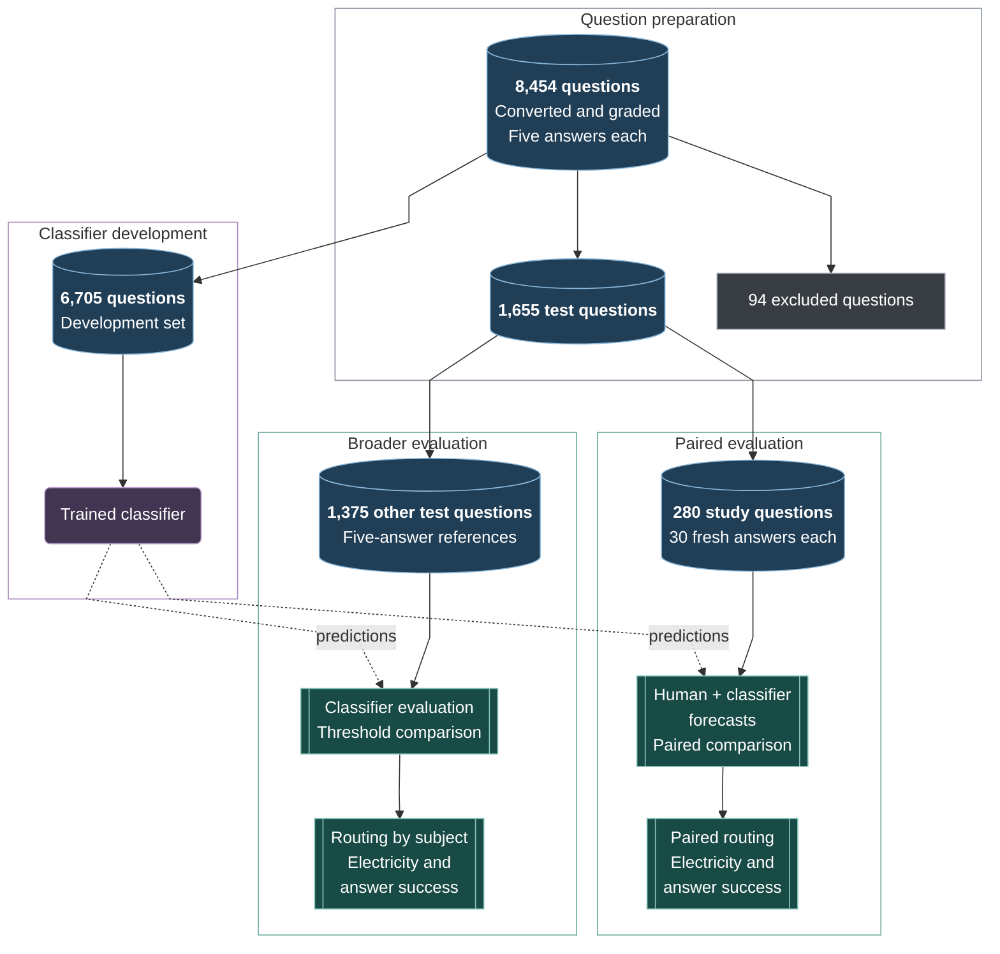
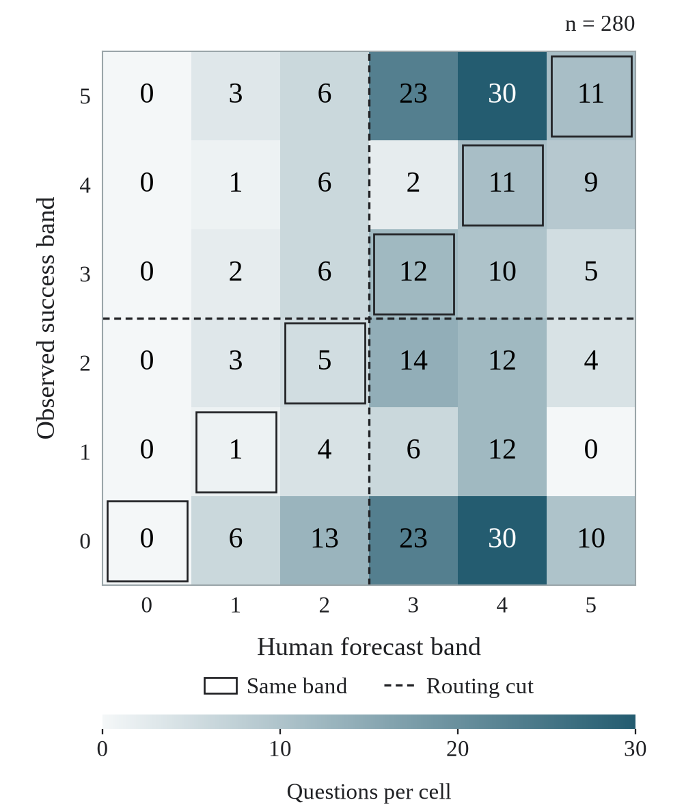

# LocalGate

### Cost Is Only Half the Decision: Users Cannot Forecast Small-Model Success

**Noah Meissner · Samuel Ruairí Bullard · Federico Mizzaro**<br>
University of Regensburg

**[Read the paper](paper/Meissner_Bullard_Mizzaro_LocalGate_AI_and_Sustainability.pdf)** · [Findings](#findings) · [Research guide](research/README.md) · [Analysis requirements](research/docs/getting-started.md)

Choosing a cheaper local model only helps if it can answer the request well
enough. Our study asks whether people or a classifier can predict that success
from the question alone, then examines what routing on those forecasts would
mean for electricity use and answer quality.

This repository contains the research materials behind the paper: supporting
results, question preparation, grading, classifier training and analysis code,
figures, and the study materials shown to participants.

## From questions to routing decisions

We converted MMLU-Pro questions to open-ended form and estimated the success of
[Gemma-4-E2B-it](https://huggingface.co/google/gemma-4-E2B-it) through repeated
generation and panel grading against the original correct answers. This gave human and classifier forecasts a common target.



Solid arrows show data flow; dashed arrows show classifier predictions.

The human study collected **840 forecasts from 30 participants** on the same
280 questions. The remaining 1,375 questions provide a broader classifier test.
The 94 excluded questions and the disjoint test subsets are explained in the
[paper](paper/Meissner_Bullard_Mizzaro_LocalGate_AI_and_Sustainability.pdf); the [detailed study map](research/README.md) connects the
full procedure.

## Findings

### Forecasting the local model’s success

Both forecasters were evaluated on the 280 study questions using the same
30-generation reference estimates. Agreement uses the median of three human
ratings per question. Human routing uses their majority decision, while the
classifier selects local generation at predicted success of at least one half.

| Forecast | Weighted agreement, κw | Routing accuracy | Routed locally |
|---|---:|---:|---:|
| Human aggregate | 0.049 | 51.8% | 80.0% |
| ModernBERT classifier | 0.237 | 62.5% | 48.6% |
| Always cloud | 0.000 | 51.1% | 0.0% |

Human forecasts overestimated local success, and individual participants also
disagreed with one another (ordinal Krippendorff’s α = 0.166). The classifier
agreed better with the reference, although its forecasts remained imperfect.
Routing accuracy describes agreement with the local/cloud reference label,
not the chance that a newly generated answer will be correct.

<p align="center">
  
</p>

Each cell counts questions. Reference bands come from 30 local answers per
question, and human bands are medians of three forecasts. The empty lowest
human band shows how strongly the aggregated forecasts avoided predicting failure.

### Consequences for electricity and answer quality

Routing trades the chance of a satisfactory local answer against the cost of
using the cloud. We compare the first answer from each selected model with an
idealised cloud that always answers correctly. Its electricity reference is
GPT-5.5 Pro; local electricity uses Gemma-4-26B-A4B-IT as a proxy, while local
success comes from the observed E2B generations.

| Questions | Policy | Expected success | Electricity (Wh/question) | Electricity saved |
|---|---|---:|---:|---:|
| 280 study | Always cloud | 100% | 101.48–269.84 | — |
| 280 study | Human aggregate | 59.3% | 20.50–54.47 | 79.8% |
| 280 study | Classifier | 80.4% | 48.85–129.29 | 51.9–52.1% |
| 1,375 remainder | Always cloud | 100% | 108.17–288.74 | — |
| 1,375 remainder | Classifier | 84.7% | 59.14–158.38 | 45.1–45.3% |

Human routing uses less electricity because it sends more questions locally,
but gives up more answer success. The classifier preserves more quality.
The balanced study questions support that paired comparison; subject profiles
come from the separate test remainder.

**These scenarios assume perfect cloud success and equal cloud/local output
lengths.** EcoLogits 0.11.1 estimates generation electricity; it does not measure
the cloud systems directly. We add the classifier's measured 0.000221 Wh per
question above idle separately. Human judgement and shared interface electricity
are excluded. The [electricity guide](research/docs/electricity.md#what-supplies-the-electricity-costs)
explains the full accounting boundary.

Absolute costs depend strongly on the cloud reference. With standard GPT-5.5,
classifier routing on the remainder uses 1.93–4.00 Wh against 3.48–7.24 Wh for
always-cloud, saving 44.5–44.8%. If failed local answers can instead be recognised
and sent to the perfect cloud, success reaches 100% by construction and more
electricity is needed. The [supporting results](research/docs/electricity.md)
show those retries, subject differences and output-length sensitivity.

## Explore the research package

| To… | Start here |
|---|---|
| Understand the methods and supporting results | [Supporting methods and results](research/README.md) |
| Repeat the selected classifier refit | [Prepare, train and predict](research/docs/classifier.md#selected-classifier-refit) · [Measure classifier electricity](research/docs/electricity.md#measure-classifier-electricity) |
| Work with the scripts or regenerate figures | [Execution instructions](research/docs/getting-started.md) · [Figure source](research/figures/) |
| View or download the figures | [Finished figures](research/docs/figures.md#finished-figures) · [PDF and PNG files](artifacts/figures/) |
| Read the submitted paper and preregistration | [Paper and preregistration](paper/) |
| See the participant instructions and study interface | [Study materials](study/README.md) · [Study interface repository](https://github.com/LocalgateOrg/Study_LocalModel) |

The browser extension and daemon will be released separately in the planned
[application repository](https://github.com/LocalgateOrg/localgate). They are
not part of this research package.

Clone the public research package:

```bash
git clone https://github.com/LocalgateOrg/localgate-research.git
cd localgate-research
```

See [Getting started](research/docs/getting-started.md) for installation and
input requirements. The finished figures can be viewed without installing the package.

## Data and models

The package includes six figures, the grading and analysis code, the classifier
electricity measurements and the classifier implementation. It does not include
participant responses, completed consent forms, model weights or raw generations.
The versioned resources under the [LocalGate organisation on Hugging Face](https://huggingface.co/localgate)
are public. Participant submissions and background responses are restricted;
the separate 30-generation study labels and generation directories also require
authorised access. The [input requirements](research/docs/getting-started.md#inputs-and-access)
explain what each workflow needs. The selected classifier can be refit from its
versioned source inputs, or analyses can read existing prediction files.

<details>
<summary>Versioned datasets, model and protocols</summary>

| Material | Versioned resource | Contents |
|---|---|---|
| Open-ended questions | [mmlu-pro-open](https://huggingface.co/datasets/localgate/mmlu-pro-open/tree/6bc069a7b1b83d93ee352dadc9fb49b59cb4dc5d) | Converted questions, split provenance, conversion prompts and schemas. |
| Screening generations | [mmlu-pro-open-gemma-generations](https://huggingface.co/datasets/localgate/mmlu-pro-open-gemma-generations/tree/44d8c1052854badc1091a64b4f5d8d8697339ab5) | Five-generation answers and evaluation records. |
| Judge panel | [judge-panel-verdicts](https://huggingface.co/datasets/localgate/judge-panel-verdicts/tree/7d5bb21170294a4895bb9e3408794d7aa3fd55a1) | Individual verdicts, consensus labels, [grading prompts and schema](https://huggingface.co/datasets/localgate/judge-panel-verdicts/tree/7d5bb21170294a4895bb9e3408794d7aa3fd55a1/protocol). |
| Conversion and calibration audits | [audit-results](https://huggingface.co/datasets/localgate/audit-results/tree/a4dcb995522f89cc7c0b695624731c94cfb3df1d) | Ratings, rubrics, metrics and provenance; see the correction note below. |
| Research classifier | [larpbert](https://huggingface.co/localgate/larpbert/tree/fd9ac7db0b68c9d2817e0ad9783f6f8bd8c6a115) | Selected beta-binomial adapter at the root, configuration and tokenizer; other heads in subdirectories. |
| Multiple-choice comparison | [mmlu-pro-closed](https://huggingface.co/datasets/localgate/mmlu-pro-closed/tree/de3c3d7bd8870e6ec48f03284f3e48042bae9ecf) · [mmlu-pro-gemma-traces](https://huggingface.co/datasets/localgate/mmlu-pro-gemma-traces/tree/59266d2b04addc7c43c99e1376b428478a3634ef) | Multiple-choice splits, generations and provenance. |

The self-containedness analysis corrects one annotator's confirmed reversal of
yes/no responses. The dataset preserves the original ratings; its uncorrected
summary metrics therefore differ from the corrected estimates in the paper.
The [audit command](research/docs/questions-and-grading.md#conversion-and-judge-audits) applies this
correction explicitly and leaves the original ratings unchanged.

</details>

## Citation

The paper is currently unpublished. [CITATION.cff](CITATION.cff) provides its
current title and author order. Include the repository commit when referring to
this package. Publication details and an archival identifier will be added when
available.

```bibtex
@unpublished{meissner2026cost,
  title  = {Cost Is Only Half the Decision: Users Cannot Forecast Small-Model Success},
  author = {Meissner, Noah and Bullard, Samuel Ruairí and Mizzaro, Federico},
  year   = {2026},
  note   = {Unpublished manuscript},
  url    = {https://github.com/LocalgateOrg/localgate-research}
}
```

## License and questions

Original research software and documentation use the [MIT license](LICENSE).
Third-party materials retain their own terms, as set out in the
[study license](study/LICENSE) and [figure icon license](research/figures/concepts/ICON_LICENSE.txt).
Model weights and third-party datasets are not relicensed by this repository.

Report package problems through repository Issues, including the command,
dependency versions and error message. Keep participant responses, credentials
and private conversation text out of issue reports.
