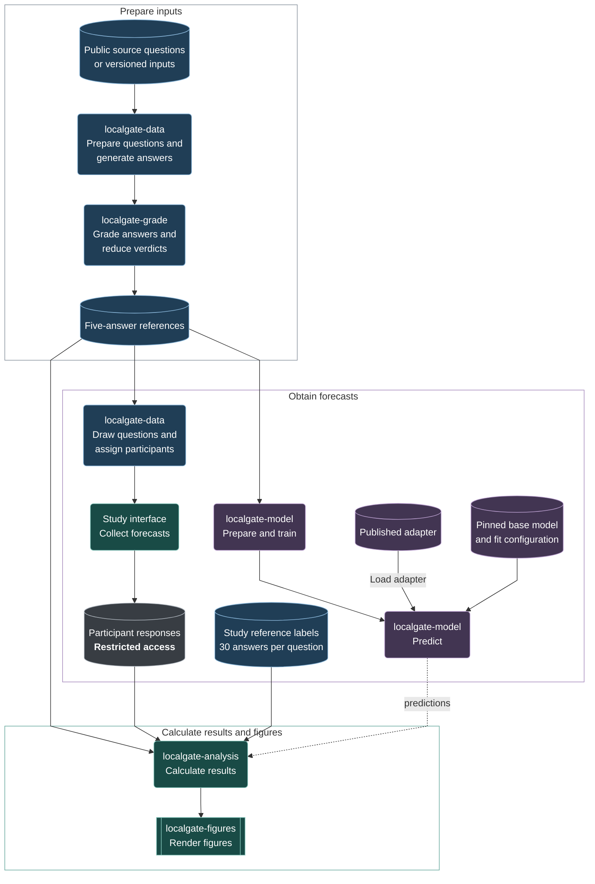

# Research guide

The study follows questions through three stages: estimating local-model
success, comparing human and classifier forecasts, and examining the electricity
and answer-quality consequences of routing on those forecasts. These guides
bring each part of the study together with its supporting results and commands.

## Where to start

| I want to… | Guide |
|---|---|
| Install the package and identify the inputs I need | [Getting started](docs/getting-started.md) |
| Understand or repeat conversion, generation and grading | [Questions and grading](docs/questions-and-grading.md) |
| Examine participant forecasts and the human analyses | [Human study](docs/human-study.md) |
| Load, train or evaluate the classifier | [Classifier](docs/classifier.md) |
| Examine electricity estimates or measure classifier inference | [Electricity](docs/electricity.md) |
| View, download or regenerate the figures | [Figures](docs/figures.md) |

## Reproduction workflow

Existing versioned datasets and predictions can enter at the relevant stage.
New generations and verdicts require the corresponding model runtime or
provider access. The diagram links to the instructions for each step.

Solid arrows show data flow; dashed arrows show classifier predictions.

The 280 study questions and the remaining 1,375 test questions do not overlap.
On the study questions, both human and classifier forecasts are compared with
30 fresh generations. The broader classifier evaluation uses five-generation
estimates. The overview is also available as a
[study-map PDF](../artifacts/figures/01_study_map.pdf), alongside the
[complete figure collection](../artifacts/figures/).

## Paper and study materials

- [Submitted paper](../paper/Meissner_Bullard_Mizzaro_LocalGate_AI_and_Sustainability.pdf)
- [Preregistration](../paper/LARP_Preregistration_Human_Judgment_of_Local_AI_Model_Solvability.pdf)
- [Original participant-facing materials](../study/README.md)
- [Versioned datasets and model](../README.md#data-and-models)

The [input requirements](docs/getting-started.md#inputs-and-access) distinguish
public resources from the separate study inputs and restricted participant responses.
