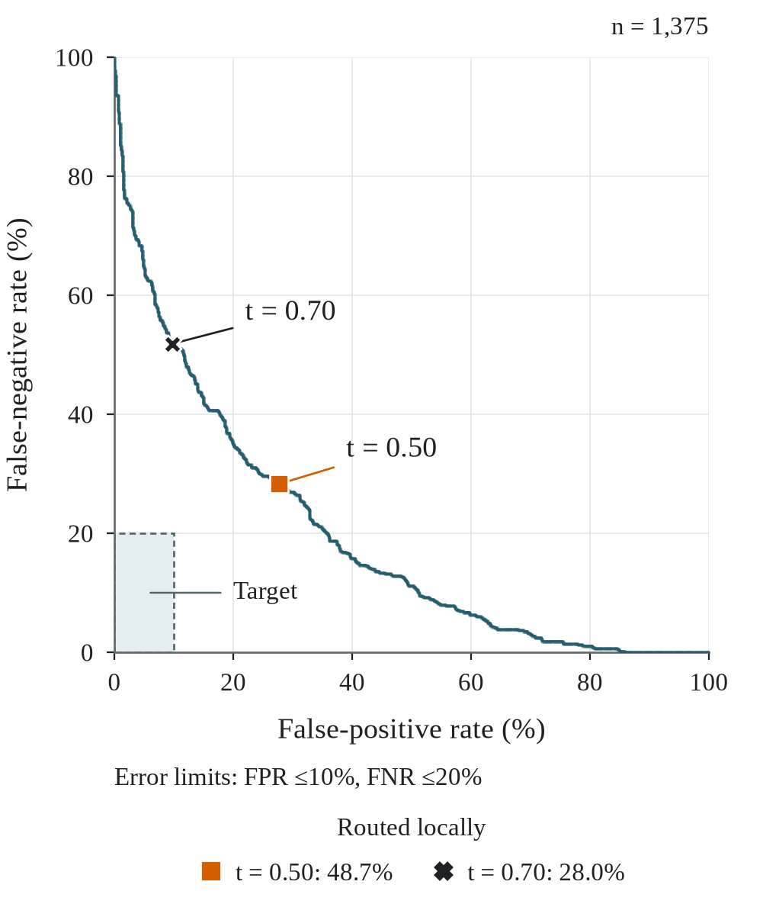
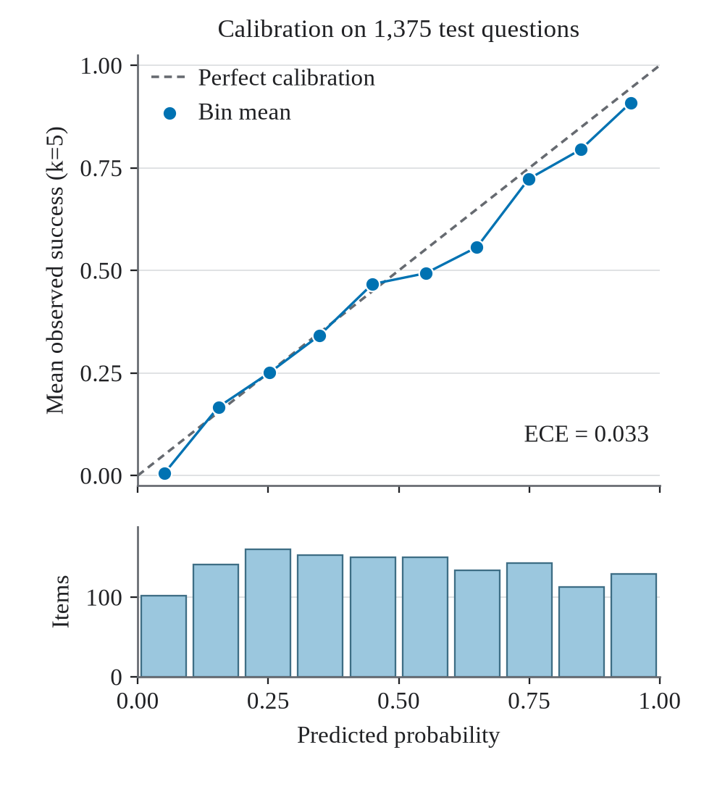

# Classifier

[Research guide](../README.md) · [Project overview](../../README.md)

The classifier predicts local-model success from question text.

The classifier learns from converted question text and five-generation success
counts. Related original or converted question texts are grouped into families
so that development folds do not share those families. The development pool
contains 6,705 questions, with all 1,655 test questions excluded. The paper
explains the 94 exclusions and reports the six-configuration cross-validation
table used to select the final head.

## Selected configuration

The selected model combines ModernBERT-base with a beta-binomial head. After
selection, it was refit on all development questions for eight epochs, using
seed 17 and a scheduler with a 20-epoch horizon. The head’s beta-distribution
mean provides the predicted probability of a satisfactory local answer.

| Component | Setting |
|---|---|
| Backbone | `answerdotai/ModernBERT-base` |
| Output head and seed | Beta-binomial; 17 |
| LoRA | Rank 8, α = 16, dropout 0.1; attention target `Wqkv` |
| Saved modules | `head`, `classifier`, `score` |
| Readout dropout | 0.1 |
| Learning rate | 0.00009468154783470064 |
| Weight decay / gradient clipping | 0.1 / 1.0 |
| Batch | 32 per device, accumulation 1; effective and evaluation batch 32 |
| Input limit / attention | 1,024 tokens / SDPA |
| Schedule | 8 training epochs, 20-epoch horizon, 4,200 scheduled steps, 420 warmup steps, 1,680 executed steps |
| Training precision | bfloat16 |
| Parameters | 150,739,204 total; 1,132,802 trainable |
| Final checkpoint | `step-1680-a6678fc6` |

The base model and tokenizer use revision
[`8949b909`](https://huggingface.co/answerdotai/ModernBERT-base/tree/8949b909ec900327062f0ebf497f51aef5e6f0c8).
The [selected training run](https://wandb.ai/uni-regensburg/localgate/runs/d2f448ac)
records its configuration, epoch-level learning curve and system measurements.
The final refit ran on an NVIDIA RTX PRO 4500 Blackwell with CUDA 13.0,
Python 3.14.7, PyTorch 2.14.0, Transformers 5.16.1 and PEFT 0.20.0.
The [classifier source](../model_source/) contains the prediction heads, decoders
and training loop, together with the data preparation needed to repeat the
selected eight-epoch refit. The [refit commands](classifier.md#selected-classifier-refit)
prepare the development corpus, train the fixed configuration and write fresh
predictions for analysis.

## Evaluation and format comparison

The reported open-ended results come from offline CPU inference in float32 with
eager attention. Both forecasters use the same 30-generation references for the
paired comparison; the 1,375-question remainder uses five-generation references.
Calibration uses ten equal-width bins, and the operating-limit sweep includes
each distinct prediction threshold and the all-local and all-cloud extremes.

The format comparison uses the same 1,655 question IDs and each format's own
five-generation labels. Both adapters were evaluated against the same
ModernBERT-base revision on an RTX PRO 4000 GPU in float32 with eager attention
and TF32 disabled. The open-trained head derives its probability from two beta shape
parameters, while the earlier multiple-choice head applies a sigmoid to its
first logit. The earlier model also used a separate validation set and selected
epoch six of eight, whereas the open-trained model was refit on all development
data. These differences make the comparison descriptive rather than a
controlled test of format alone.



The threshold sweep shows the trade-off between sending unsuitable questions
locally and sending locally solvable questions to the cloud.
[Download the error-limit figure as PDF](../../artifacts/figures/03_error_limits.pdf).



Calibration compares predicted success with observed success within probability
bins. [Download the calibration figure as PDF](../../artifacts/figures/calibration_reliability.pdf).

## Inputs and outputs

Start with [installation and access requirements](getting-started.md).
The steps exchange these files:

| Step | Output | Used by |
|---|---|---|
| Prepare development data | `development.jsonl` and `manifest.json` | Training and the development-only category baseline |
| Train the selected model | `receipt.json` and the selected adapter checkpoint | Prediction and electricity measurement |
| Predict | Study, held-out and combined JSONL prediction files | Classifier analysis, electricity scenarios and figures |
| Measure classifier electricity | Measurement CSV | Classifier overhead in the electricity comparison |

## Use the published adapter

The [versioned adapter](../../README.md#data-and-models) can be used without
retraining. Prediction still requires the pinned ModernBERT snapshot, the
matching published fit record and the evaluation files described below.
The fit record supplied through `--config` is distinct from the adapter's
`adapter_config.json`. Obtain the matching fit record with the study inputs;
the adapter download alone is not a complete prediction setup.

Install the `model` extra as shown in the refit instructions. Use the downloaded
adapter directory and its fit record in place of the checkpoint and receipt:

```bash
uv run localgate-model predict \
  --config /path/to/published-fit-record.json \
  --base-model /path/to/local/ModernBERT-snapshot \
  --adapter /path/to/published-adapter \
  --data-dir /path/to/evaluation-data --group study \
  --output "$PWD/output/model/study280_predictions.jsonl"
```

Use `--group heldout` or `--group combined` with the corresponding distinct output
filename for the other prediction sets. The checks enforce the published
adapter and base-model identities.

## Selected classifier refit

> [!IMPORTANT]
> Training requires a CUDA GPU with BF16 support. Prediction can run on the CPU.

The package can repeat the final selected refit without rerunning model selection
or hyperparameter search. It validates the required source files, prepares the
6,705-question development corpus, trains the fixed beta-binomial configuration
for eight epochs and writes predictions for the two test groups. Training runs
locally.

Install the model dependencies, then prepare the development data. The source
directory must contain `labels.jsonl`, `labels_open.jsonl`, `converted.jsonl`,
`study_prompts.jsonl`, `split.json` and `open_ended_raw_performance.csv`.

```bash
uv sync --python 3.13 --extra model --locked

uv run localgate-model prepare \
  --data-dir /path/to/evaluation-data \
  --output-dir "$PWD/output/prepared"

uv run localgate-model train \
  --manifest "$PWD/output/prepared/manifest.json" \
  --base-model /path/to/local/ModernBERT-snapshot \
  --output-dir "$PWD/output/selected-fit"
```

The base-model directory must be a local copy of the pinned ModernBERT revision
shown in the selected configuration above. The package's locked environment uses
PyTorch 2.13.0 and Transformers 5.14.1, while the recorded refit used the versions
listed above, so fresh model weights need not be byte-identical.

Training writes its completed result to `receipt.json`. To resume an interrupted
run, repeat the same training command with `--resume`; its saved configuration
and inputs must match.

Read the selected checkpoint from that receipt rather than assuming a checkpoint
directory name. Prediction also needs `labels_study_k30.jsonl` and
`study_prompts_corpus.jsonl` in the evaluation-data directory. It defaults to
CPU FP32 inference with eager attention; `--device cuda` uses the same inference
settings on a GPU.

```bash
SELECTED_CHECKPOINT="$(uv run python -c \
  'import json; print(json.load(open("output/selected-fit/receipt.json"))["selected_checkpoint"])')"

uv run localgate-model predict \
  --config "$PWD/output/selected-fit/receipt.json" \
  --base-model /path/to/local/ModernBERT-snapshot \
  --adapter "$PWD/output/selected-fit/$SELECTED_CHECKPOINT/adapter" \
  --data-dir /path/to/evaluation-data --group study \
  --output "$PWD/output/model/study280_predictions.jsonl"

uv run localgate-model predict \
  --config "$PWD/output/selected-fit/receipt.json" \
  --base-model /path/to/local/ModernBERT-snapshot \
  --adapter "$PWD/output/selected-fit/$SELECTED_CHECKPOINT/adapter" \
  --data-dir /path/to/evaluation-data --group heldout \
  --output "$PWD/output/model/heldout1375_predictions.jsonl"

uv run localgate-model predict \
  --config "$PWD/output/selected-fit/receipt.json" \
  --base-model /path/to/local/ModernBERT-snapshot \
  --adapter "$PWD/output/selected-fit/$SELECTED_CHECKPOINT/adapter" \
  --data-dir /path/to/evaluation-data --group combined \
  --output "$PWD/output/model/combined1655_predictions.jsonl"
```

The study and held-out files feed the classifier analysis. The combined file
provides reference predictions for [classifier electricity measurement](electricity.md#measure-classifier-electricity).

## Calculate classifier results

The classifier data directory contains `converted.jsonl`, `labels_open.jsonl`,
`labels_study_k30.jsonl`, `study_prompts_corpus.jsonl` and `split.json`. The
command uses development-only subject means and reports the study cohort
separately from the 1,375-question remainder. Add
`--primary-human-report output/human/human_descriptive.json` only when computing
the paired human-classifier comparison. The `format` subcommand compares the
multiple-choice and open-ended classifiers; for that command, the data directory
only needs `converted.jsonl`, `labels_open.jsonl` and `split.json`.

```bash
uv run localgate-analysis classifier \
  --study-predictions "$PWD/output/model/study280_predictions.jsonl" \
  --heldout-predictions "$PWD/output/model/heldout1375_predictions.jsonl" \
  --data-dir /path/to/evaluation-data \
  --development "$PWD/output/prepared/development.jsonl" \
  --development-manifest "$PWD/output/prepared/manifest.json" \
  --output-dir "$PWD/output/classifier"
```

### Compare question formats

<details>
<summary>Run the four-cell format comparison</summary>

```bash
uv run localgate-analysis classifier format \
  --open-on-open /path/to/open-on-open.jsonl \
  --mc-on-open /path/to/mc-on-open.jsonl \
  --open-on-mc /path/to/open-on-mc.jsonl \
  --mc-on-mc /path/to/mc-on-mc.jsonl \
  --data-dir /path/to/evaluation-data \
  --mc-corpus /path/to/matched_mc_test.jsonl \
  --output-dir "$PWD/output/format"
```

</details>

## Next steps

Use the predictions in the [electricity scenarios](electricity.md) or
[figure generation](figures.md).
