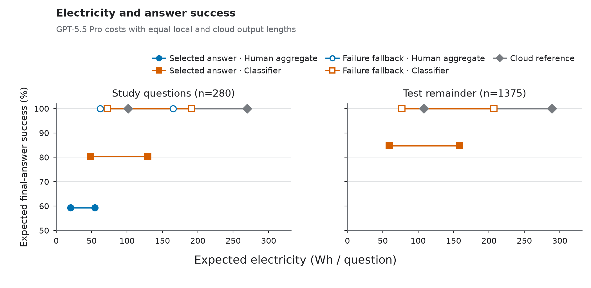
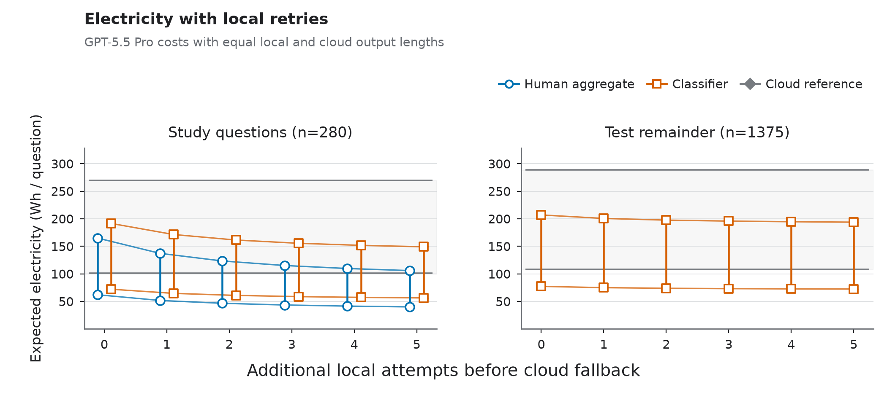

# Electricity

[Research guide](../README.md) · [Project overview](../../README.md)

The electricity analysis combines modelled routing scenarios with measurements
of the classifier's own electricity use.

The routing comparison starts with a simple choice: accept the first answer
from the selected model. Local success is the observed fraction of satisfactory
E2B answers to each question; cloud success is fixed at one. This perfect cloud
reference makes the loss in expected answer success explicit. Human and
classifier routing share the 280 study questions and their 30-generation
references. The 1,375 remaining test questions retain five-generation references
and provide the subject breakdown below.

## What supplies the electricity costs?

[EcoLogits 0.11.1](https://github.com/mlco2/ecologits/releases/tag/0.11.1)
provides generation estimates through its
[release catalogue](https://github.com/mlco2/ecologits/blob/0.11.1/ecologits/data/models.json).
The local proxy is `gemma-4-26b-a4b-it`, since E2B is not covered; its success
rates still come from E2B. The high-cost cloud reference is
`gpt-5.5-pro-2026-04-23`, with `gpt-5.5-2026-04-23` as a comparison. Neither
reference represents observed cloud accuracy or measured consumer-device costs.

Each question retains its own mean local output length. Cloud length initially
matches it, and is also evaluated at half and twice that length. The
[EcoLogits inference model](https://ecologits.ai/0.11/methodology/llm_inference/)
includes GPU and allocated non-GPU server electricity with a PUE adjustment for
datacentre cooling. It excludes networking, storage, provider services such as
backups and monitoring, full input-processing and end-user-device costs. The
supplied costs cover output generation, and hardware-production costs are also
outside this comparison. Both estimator endpoints are carried through the same
policy comparison; their spans are not confidence intervals.

Classifier inference contributes **0.000221 Wh per request above idle**, measured
on an Intel Core Ultra 7 258V laptop. Three passes of all 1,655 questions used
CPU FP32 inference, batch size one and four threads, after loading and warm-up.
RAPL package and DRAM readings gave 0.000387 Wh per question gross. The
[measurement script and readings](electricity.md#classifier-electricity-measurement) document that boundary.
The cost applies even when the classifier selects cloud; human judgement and
shared interface electricity are outside the comparison.

## Quality and electricity together



On the paired questions, accepting the selected answer gives 59.3% expected
success under human routing and 80.4% under classifier routing. Their electricity
use is 20.50–54.47 and 48.85–129.29 Wh per question respectively, against
101.48–269.84 Wh for all-cloud. Human routing selects local generation more
often and therefore saves more electricity while accepting more failures.

On the test remainder, classifier routing gives 84.7% expected success at
59.14–158.38 Wh per question, saving 45.1–45.3%. The subject table keeps
question-level probabilities intact before averaging. Subjects are benchmark
workloads, not measured profiles of everyday use; small groups warrant caution.

<details>
<summary>Electricity results by subject</summary>

| Subject | Questions | Routed locally | Success | Always cloud (Wh) | Selected answer (Wh) | Saved (%) | With fallback (Wh) |
|---|---:|---:|---:|---:|---:|---:|---:|
| Overall | 1375 | 48.7 | 84.7 | 108.17–288.74 | 59.14–158.38 | 45.1–45.3 | 77.23–206.92 |
| Biology | 58 | 58.6 | 72.1 | 85.42–224.48 | 32.35–84.39 | 62.1–62.4 | 55.96–146.38 |
| Business | 110 | 65.5 | 77.1 | 72.70–188.54 | 27.23–71.07 | 62.3–62.5 | 46.27–121.01 |
| Chemistry | 166 | 45.8 | 79.4 | 139.42–377.01 | 85.66–232.81 | 38.2–38.6 | 112.34–304.71 |
| Computer science | 28 | 89.3 | 87.9 | 92.14–243.44 | 11.32–30.10 | 87.6–87.7 | 21.62–57.15 |
| Economics | 72 | 73.6 | 75.8 | 99.98–265.59 | 26.06–69.10 | 73.9–74.0 | 52.80–140.59 |
| Engineering | 150 | 25.3 | 93.1 | 187.33–512.32 | 153.69–421.53 | 17.7–18.0 | 164.74–451.57 |
| Health | 50 | 28.0 | 90.8 | 61.02–155.55 | 44.36–113.20 | 27.2–27.3 | 49.30–125.60 |
| History | 5 | 0.0 | 100.0 | 44.43–108.70 | 44.43–108.70 | 0.0 | 44.43–108.70 |
| Law | 147 | 2.7 | 98.4 | 102.03–271.40 | 98.88–262.94 | 3.1 | 100.63–267.61 |
| Math | 207 | 92.8 | 85.9 | 110.20–294.47 | 8.56–22.87 | 92.2 | 33.69–91.49 |
| Other | 79 | 32.9 | 85.3 | 48.63–120.55 | 25.85–61.74 | 46.8–48.8 | 36.38–89.01 |
| Philosophy | 47 | 10.6 | 97.9 | 52.11–130.39 | 45.91–114.65 | 11.9–12.1 | 47.51–118.82 |
| Physics | 200 | 57.5 | 76.6 | 114.78–307.42 | 55.72–150.20 | 51.1–51.5 | 84.16–226.61 |
| Psychology | 56 | 26.8 | 86.4 | 79.20–206.90 | 51.60–133.42 | 34.8–35.5 | 66.07–172.02 |

</details>


Wh values are per question. “Selected answer” accepts one answer without
fallback; “with fallback” sends a recognised local failure to the perfect cloud
after one local attempt. Its final success is 100% by construction. History has
no local selections, so its only extra cost is classifier inference, hidden by
rounding. Overall values weight questions rather than subjects equally.

## Recovering from local failures



If each failed answer can be recognised, locally selected questions may receive
up to six attempts before cloud fallback. Attempts stop at the first success;
unresolved questions receive one perfect cloud answer. All policies then reach
100% success by assumption. Direct and fallback calls use the same cloud cost.
Retries assume independent draws at each question's fixed observed success
rate. The 10,000 simulations use seed `20260929` and agree with exact expectations;
their standard errors describe simulation precision, not uncertainty in the
five- or thirty-generation success estimates.

With no extra local retry, classifier routing on the remainder uses
77.23–206.92 Wh per question. Additional retries can avoid more cloud calls,
but also incur local generation costs.

## How much does the reference model matter?

Pro's much larger cost estimates come from the catalogue's inferred architecture
and deployment assumptions. With standard GPT-5.5 costs, first-answer routing
on the remainder uses 1.93–4.00 Wh instead of 3.48–7.24 Wh for all-cloud,
saving 44.5–44.8%. Absolute savings therefore change greatly while the relative
saving remains similar in this comparison.

Across both references and cloud output-length multipliers of 0.5, 1 and 2,
first-answer classifier routing saves 44.0–45.6% on the remainder. Under
recognised-failure recovery with zero to five extra local retries, savings span
27.2–33.4%. These are ranges across scenarios, separate from the two EcoLogits
endpoints within a setting. Removing classifier overhead has little effect
because its measured cost is small relative to generation.

The [analysis commands](#calculate-electricity-scenarios) calculate every setting, including the
separate study cohort. The paper's appendix gives the equations. Rebuilding the
figures requires those calculated outputs and their source inputs, including
private participant data for the human comparison.


## Classifier electricity measurement

[The measurement implementation](../model_source/measure_energy.py) and
[recorded readings](../model_source/classifier_energy.csv) cover three warm CPU
inference passes over all 1,655 test questions on an Intel Core Ultra 7 258V.
Each pass used FP32, eager attention, batch size one and four threads. The
laptop was discharging in balanced mode.

Cumulative RAPL package and DRAM counters gave **0.000387248 Wh per question
gross** and **0.000221337 Wh above matched idle**. Package subdomains were not
counted twice. Loading and the ten-question warm-up were outside the measured
interval; tokenisation and the forward pass were inside it. This measures CPU
package and DRAM energy, not whole-device electricity at the wall.

Every prediction was checked against the supplied reference predictions, with a
maximum absolute probability difference of 7.63e-6 in the recorded run. The CSV
contains the individual passes, durations, gross and idle readings, hardware
settings and input identifiers. The [selected-refit workflow](classifier.md#selected-classifier-refit)
produces the model, configuration and combined predictions required for a
new measurement.

The [measurement command](#measure-classifier-electricity) uses RAPL counters when they are
readable on compatible Linux hardware. Otherwise it reports a CodeCarbon
software estimate, which has a different boundary from the recorded RAPL result.

The selected adapter uses the two-output beta-binomial head in
[the classifier source](../model_source/localgate_research/heads.py). Its decoder
is defined there alongside the other heads.

## Measure classifier electricity

First obtain the model, fit configuration and combined predictions through the
[classifier workflow](classifier.md). Install the measurement dependencies,
then run the command on compatible hardware:

```bash
uv sync --python 3.13 --extra measurement --locked

SELECTED_CHECKPOINT="$(uv run python -c \
  'import json; print(json.load(open("output/selected-fit/receipt.json"))["selected_checkpoint"])')"

uv run localgate-model measure \
  --data-dir /path/to/evaluation-data \
  --config "$PWD/output/selected-fit/receipt.json" \
  --base-model /path/to/local/ModernBERT-snapshot \
  --adapter "$PWD/output/selected-fit/$SELECTED_CHECKPOINT/adapter" \
  --reference-predictions "$PWD/output/model/combined1655_predictions.jsonl" \
  --passes 3 --threads 4 --warmup-queries 10 \
  --output "$PWD/output/classifier_energy.csv"
```

## Calculate electricity scenarios

Use the [installation and output-directory conventions](getting-started.md).

The electricity command reads per-question predictions, generation token
counts and the freshly calculated human report. The generation directory must
contain `gemma-4-E2B-it_openlabel/rep0` through `rep4` and
`gemma-4-E2B-it_study_k30/rep0` through `rep29`, each with `generations.jsonl`.
The command reads the study and held-out prediction files separately. Its data
directory contains `converted.jsonl`, `labels_open.jsonl`,
`labels_study_k30.jsonl`, `study_prompts_corpus.jsonl` and `split.json`. The
analysis checks question IDs, labels and source hashes before combining inputs.

```bash
uv run localgate-analysis energy \
  --study-predictions "$PWD/output/model/study280_predictions.jsonl" \
  --heldout-predictions "$PWD/output/model/heldout1375_predictions.jsonl" \
  --data-dir /path/to/evaluation-data \
  --generation-results-dir /path/to/generation-results \
  --human-report output/human/human_descriptive.json \
  --cloud-model gpt-5.5-pro-2026-04-23 --repetitions 10000 \
  --output output/energy-pro

```

<details>
<summary>Repeat the scenarios with the standard GPT-5.5 cost reference</summary>

```bash
uv run localgate-analysis energy \
  --study-predictions "$PWD/output/model/study280_predictions.jsonl" \
  --heldout-predictions "$PWD/output/model/heldout1375_predictions.jsonl" \
  --data-dir /path/to/evaluation-data \
  --generation-results-dir /path/to/generation-results \
  --human-report output/human/human_descriptive.json \
  --cloud-model gpt-5.5-2026-04-23 --repetitions 10000 \
  --output output/energy-standard
```

</details>

Each energy output directory includes `inputs.json` with the actual input hashes,
cloud model, repetition count and simulation seed used for that run.

EcoLogits 0.11.1 provides the generation costs. Both references use the same
10,000-repetition simulation, seed `20260929`, and local retry limits of zero
to five extra attempts. The default classifier cost comes from the original
measurement described in this guide.

## Next steps

The scenario CSVs feed [figure generation](figures.md#regenerate-the-figures).
The [scenario analysis](../analysis/energy.py) and
[measurement implementation](../model_source/measure_energy.py) cover the two calculations.
