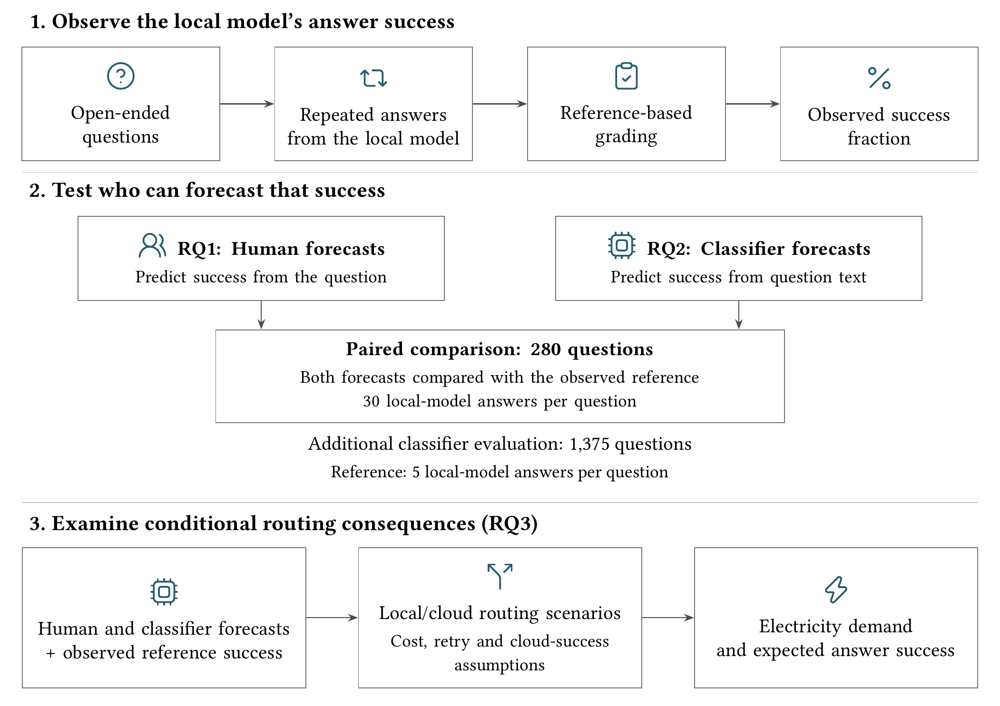

# Figures

[Research guide](../README.md) · [Project overview](../../README.md)

The finished figures can be viewed without installing the package.

## Finished figures

All six figures are supplied as PNGs for reading and PDFs for reuse.

| Figure | Preview | PDF |
|---|---|---|
| Study overview | [PNG](../../artifacts/figures/01_study_map.png) | [PDF](../../artifacts/figures/01_study_map.pdf) |
| Human forecast agreement | [PNG](../../artifacts/figures/02_human_disagreement.png) | [PDF](../../artifacts/figures/02_human_disagreement.pdf) |
| Classifier routing error limits | [PNG](../../artifacts/figures/03_error_limits.png) | [PDF](../../artifacts/figures/03_error_limits.pdf) |
| Forecast calibration | [PNG](../../artifacts/figures/calibration_reliability.png) | [PDF](../../artifacts/figures/calibration_reliability.pdf) |
| Electricity and answer success | [PNG](../../artifacts/figures/oracle_tradeoff.png) | [PDF](../../artifacts/figures/oracle_tradeoff.pdf) |
| Local retries and cloud fallback | [PNG](../../artifacts/figures/oracle_retries.png) | [PDF](../../artifacts/figures/oracle_retries.pdf) |



## Inputs and renderers

| Figure | Required source inputs | Renderer |
|---|---|---|
| Study overview | Human report and held-out predictions | [Study overview](../figures/concepts/build_study_overview.py) |
| Human forecast agreement | Per-question records in the human report | [Human heatmap](../figures/concepts/build_human_heatmap.py) |
| Classifier routing error limits | Held-out predictions | [Classifier limits](../figures/concepts/build_classifier_limits.py) |
| Forecast calibration | Held-out predictions | [Calibration](../figures/concepts/calibration_supplement.py) |
| Electricity and answer success | Study and held-out oracle CSVs; classifier electricity per request | [Electricity scenarios](../figures/oracle_scenarios.py) |
| Local retries and cloud fallback | Study and held-out oracle CSVs; classifier electricity per request | [Electricity scenarios](../figures/oracle_scenarios.py) |

The `concepts/` directory also contains the LaTeX drawing sources. The common
[figure command](../figures/reproduce.py) runs the renderers and collects their exports.
[Icon sources](../figures/concepts/icon_sources.json) identify the icons used in
the study map; their terms are retained in the
[icon licence](../figures/concepts/ICON_LICENSE.txt).

## Rendering dependencies

Figure generation also needs `latex`, `pdflatex`, `dvisvgm` and `pdftoppm`
on `PATH`, with the LaTeX `geometry`, `libertine` and `tikz` packages. On
Debian or Ubuntu these are supplied by `texlive-latex-base`,
`texlive-fonts-extra`, `texlive-pictures`, `dvisvgm` and `poppler-utils`.

Complete the ordinary [installation](getting-started.md#installation) before
rendering. The scientific Python dependencies are included in that installation.

## Regenerate the figures

Calculate the [human report](human-study.md#calculate-human-results), obtain the
[held-out predictions](classifier.md) and run the
[electricity scenarios](electricity.md#calculate-electricity-scenarios) first.
The complete six-figure run requires restricted human-study inputs.

```bash
uv run localgate-figures \
  --human-report output/human/human_descriptive.json \
  --heldout-predictions "$PWD/output/model/heldout1375_predictions.jsonl" \
  --oracle-study-csv output/energy-pro/study280_oracle.csv \
  --oracle-heldout-csv output/energy-pro/heldout1375_oracle.csv \
  --classifier-wh 0.00022133699853226423 \
  --output-dir output/figures
```

The figure command calculates its plotting tables from these inputs and writes
six figures as PDF, SVG and PNG under `output/figures`. Finished PDF and PNG
copies in [artifacts/figures](../../artifacts/figures/) remain unchanged;
SVGs are generated on demand.

## Related guides

The [human study](human-study.md), [classifier](classifier.md) and
[electricity](electricity.md) guides explain the findings shown in these figures.
